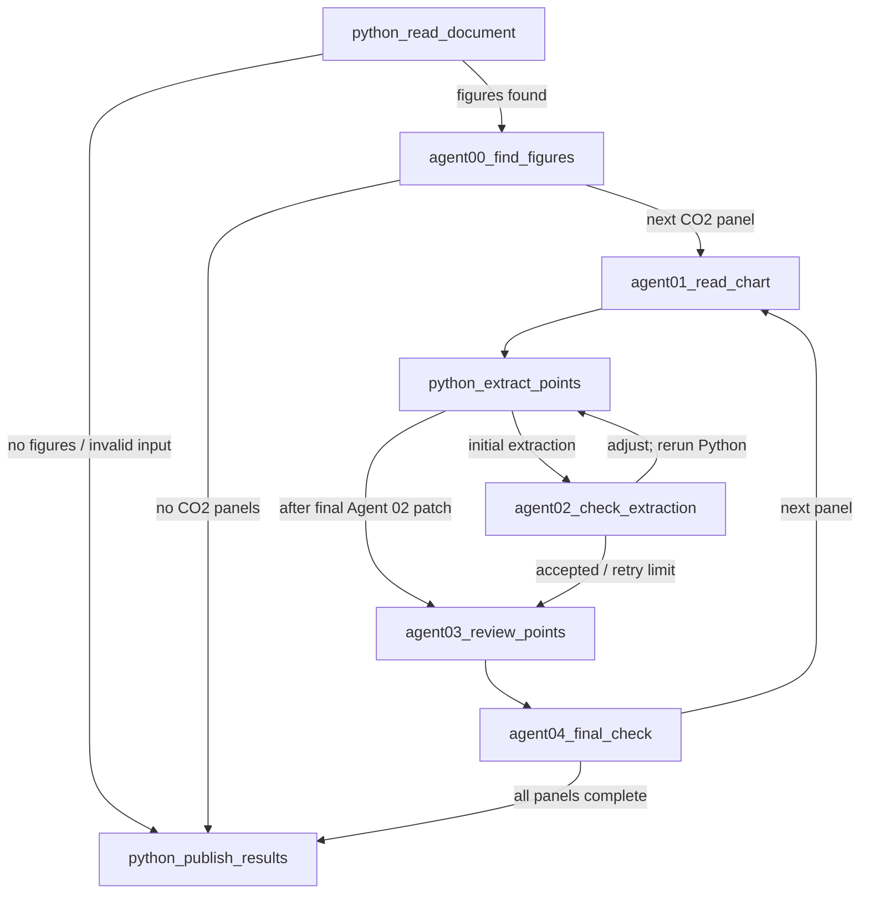

# Current chart extraction workflow

This document describes the workflow implemented in this repository as inspected on 2026-10-02. The executable graph is defined in `workflow.yaml`; `src/workflow/build.py` binds those configured IDs to Python executors. The project extracts CO2 isotherm marker coordinates from a PDF or image, has two model reviewers inspect the evidence, and publishes CSVs and HTML review pages. Document reading, image analysis, validation, and publication run locally. Prompt Agent calls and Code Interpreter review calls use the configured Microsoft Foundry project.

## Process at a glance



The workflow state is a `DocumentRun` plus its selected panel list. Large intermediate results are written to each panel's directory and read back at later stages, which makes the run inspectable and allows saved stages to be rerun. A failure in a panel is recorded in that panel and does not intentionally stop processing of the remaining panels.

## Step-by-step

| Step | What it does | Main inputs | Main outputs / next route |
|---|---|---|---|
| 1. `python_read_document` | Resolves one attached file, accepted input-folder filename, local path, or HTTP(S) URL. For PDFs, extracts document text, figure candidates, caption/reference candidates, and page previews; for an image, creates a one-figure inventory. | `--run` argument/message; `data/input/` by default; PDF/image settings in `config.yaml`. | `discovery/python_inventory.json`, candidate figure files/previews under `discovery/python_inventory/`, and a `DocumentRun`. Continues to Agent 00 if candidates exist; otherwise publishes a no-work summary. |
| 2. `agent00_find_figures` | Calls pinned Agent 00 once for every figure candidate. It sees candidate figure images, page preview (if available), caption and document context, figure references, and the CO2-scope policy. Valid answers are checkpointed; a matching checkpoint can be reused after an interrupted run. It selects CO2-isotherm panels and their panel crops/bounds. | Python inventory and `schemas/co2_scope.policy.json`; Agent 00 prompt/schema/example and configured Foundry identity. | `discovery/agent00_find_figures.json`; panel descriptors and canonical panel IDs such as `fig2`, `fig3a`, `figp7`. Goes to the first panel or publishes if none qualify. |
| 3. `agent01_read_chart` | Crops each selected panel from the source figure and asks Agent 01 to read chart structure: axes, units, linear/log scales, tick labels, plot frame, legend, series labels/styles, and panel geometry. The code builds `spec.json`, validates the CO2 series against policy, and can preserve exact vector marker evidence from vector PDFs. If the legend is clipped, it expands the crop once and asks again; a still-clipped or unfixable legend stops the panel for human review. | Source figure, Agent 00 panel metadata, Agent 01 prompt/schema/example, CO2 policy. | `panel.png`, `spec.json`, `agent01/answer.json`, `agent01/evidence.json` and optional vector-mark evidence. A panel without an eligible CO2 series is marked for review; otherwise proceeds to Python extraction. |
| 4. `python_extract_points` | Deterministically calibrates pixel coordinates to axis values from the spec and source pixels, detects marker candidates, assigns them to series, and writes checks/overlays/redraws. It also records continuous dense-band support separately; trace samples do not become marker rows. Agent 02 changes to ticks, bounds, masks, or region strategies are applied before the next extraction. | `panel.png`, `spec.json`, `config.yaml` extraction settings, plus any prior Agent 02 corrections. | `python/points.csv`, `python/points.json`, `python/summary.json`, `python/audit.json`, diagnostic images, and optional `python/supporting_traces.json`; round snapshots when inside the check loop. Always goes to Agent 02 initially. |
| 5. `agent02_check_extraction` | Reviews chart structure, axis calibration, and Python candidates against the source. It may return a full plan and at most one targeted patch. Python is rerun for each applied correction. The latest checked spec and its candidate stay paired; score diagnostics do not roll back the reviewer-selected structure. | Native panel/source evidence; Python output and diagnostics; Agent 02 prompt/schema/example. | `agent02/answer.json`, round records under `agent02/round<N>.json`, and checked extraction snapshots under `python/rounds/`. It routes back to Python while a correction is requested. After acceptance or the bounded retry is exhausted, it hands off to Agent 03; an unresolved check keeps the panel flagged for human review. |
| 6. `agent03_review_points` | Performs an independent source-pixel review of the full candidate. Local code creates overlays, native zoom tiles, dense measurement targets, and (when enabled/requested) missing-strip recovery evidence. Agent 03 reports point additions, deletions, moves, or reassignments and measured pixel centers. If dense measurement validation fails, it gets one focused correction request. Local code validates/applies edits and records an audit. | Python candidate accepted for handoff by Agent 02, `spec.json`, source panel, generated tiles and measurement targets, and the stage-specific runtime profile. | `agent03/answer.json`, `agent03/points.csv`, `agent03/points.json`, `agent03/audit.json`, measurement targets/answers, batch records, and review images. Proceeds to Agent 04. |
| 7. `agent04_final_check` | Starts from the Agent 03 CSV, JSON, and report, checks them against unchanged source pixels, and makes the authoritative final decisions. It returns the complete replacement CSV inline with its QA JSON report; local QA persists and validates those exact UTF-8 bytes, stable point IDs, series ownership, coordinate/calibration support, and declared edits. If candidate IDs are omitted without explicit deletion, one correction request is made; if still incomplete, the Agent 03 inventory is retained and flagged for repair. Diagnostics do not substitute for source evidence. | `panel.png`, `spec.json`, Agent 03 CSV/JSON/report, Agent 04 runtime profile, prompt/schema/example, shared vocabulary and CSV contract. | `agent04/authored/attempt-<N>.csv`, `agent04/answer.json`, `agent04/points.csv`, `agent04/points.json`, `agent04/audit.json`, `qa.json`, comparison images, and `review.html`. Marks the panel done or review, then advances to the next panel or publication. |
| 8. `python_publish_results` | Collects final stage rows for all panels, records run metadata, rebuilds aggregate tables/dashboard, and returns a short run report. | `DocumentRun`; final Agent 04 outputs and panel statuses; output layout settings. | `<document>/final.csv`, `discovery/run_summary.json`, master CSVs, aggregation report, dashboard, and final response text. |

### Evidence and review rules

- Source pixels are the authority. Python detections, redraws, overlays, fits, and agent reports are supporting evidence.
- Python marker rows, dense trace samples, and Agent 03/04 measured point rows are separate concepts. Dense bands are written to `python/supporting_traces.json`; they do not silently create measured marker rows.
- Agent 03 edits are applied locally and audited. Agent 04 supplies a complete replacement CSV that is validated before it becomes the final panel inventory.
- Unresolved, inferred, overlapping, or incomplete evidence keeps the panel in review. Agent 04 cannot accept a panel while coverage remains incomplete or unresolved slots remain.
- `checks.py` and hard checks produce diagnostics. They do not override the reviewed source-supported inventory.

### Model calls and retries

Calls run sequentially. Agent 00 uses Foundry structured JSON output. Agents 01 and 02 use their pinned free-text agent versions, then the local workflow validates their JSON response and can issue one schema-correction request if needed. Every agent's visual/file inputs are selected by its `runtime/agentNN.yaml` profile; Agents 03 and 04 mount their selected files in short-lived Code Interpreter sessions. Agent 04 returns its report and final CSV inline, so its success path does not download Code Interpreter container files. Their long per-call timeouts are set in `workflow.yaml`; SDK retries are disabled to avoid silently repeating a potentially paid request. Agent 03 allows one focused measurement correction, and Agent 04 allows one correction when its replacement CSV omits candidate point IDs without declared deletes.

## Configuration and invocation

| Concern | Source of truth |
|---|---|
| Workflow graph, IDs, routes, per-step response mode/instructions/timeouts, prompt/schema/example paths, iteration limits | `workflow.yaml` |
| Local input/output/review directories, accepted extensions, names, PDF render settings, detector tuning, numeric checks | `config.yaml`; `CHART_EXTRACT_<FOLDER>_DIR` can override configured folders |
| Foundry endpoint, auth mode, pinned Prompt Agent names and versions | Private `.env` (template: `.env.example`). Agent identity is read from `FOUNDRY_AGENT_<NN>_NAME` and `_VERSION`. |
| Detailed model task text and CO2 inclusion policy | `prompts/` and `schemas/co2_scope.policy.json` |
| Agent file/image input lists | `runtime/agent00.yaml` through `runtime/agent04.yaml` |
| Output and panel naming | `config.yaml` and `src/models/naming.py` |

Typical commands:

```powershell
python main.py --run paper.pdf
python main.py --graph
python main.py --rerun --document RUN --agent 03 --all
python main.py --rerun --document RUN --agent 04 --only
python scripts/review_server.py
```

`--only` reruns a selected saved stage and leaves downstream files stale; the panel is marked for review when applicable. `--all` reruns it and downstream stages. Discovery and crop/panel-selection changes require a fresh `--run`. `--rerun` requires an agent number (`01`–`04`) and either `--only` or `--all`.

## Output layout

Default root is `artifacts/runs/` (overridable with `CHART_EXTRACT_OUTPUT_DIR`). A document run uses:

```text
artifacts/runs/<document>/
  discovery/
    python_inventory.json
    python_inventory/                 # rendered/extracted source candidates and previews
    agent00_find_figures.json
    run_summary.json
  <figure_id>/                         # one directory per selected CO2 panel
    panel.png
    spec.json
    qa.json
    review.html
    log.json
    python/{points.csv,points.json,summary.json,audit.json,supporting_traces.json,images/,rounds/}
    agent01/{answer.json,evidence.json,...}
    agent02/{answer.json,roundN.json,...}
    agent03/{answer.json,points.csv,points.json,audit.json,images/,batches/,measurement_targets.json}
    agent04/{authored/attempt-<N>.csv,answer.json,points.csv,points.json,audit.json,images/}
  final.csv
  dashboard.html
  all_data.csv
  all_data_accepted.csv
  all_data_review.csv
  aggregation_report.json
```

`final.csv` is the document's final panel rows. `all_data.csv` aggregates rows; `all_data_accepted.csv` and `all_data_review.csv` split them by review state. The HTML dashboard and per-panel `review.html` support manual review. A human-saved correction goes under `artifacts/reviews/` by default, after which the master tables can be rebuilt.

## File inventory

“Currently used” means used by a normal `python main.py --run` path or by a supported operational action described above. `Y (conditional)` means loaded by that path but only contributes when its feature/input condition applies. `N` means documentation, tests, evaluation/reference material, or a maintenance utility outside the normal run path. The `path` column is repository-relative unless it says runtime output or local/private config.

### Entry point, workflow orchestration, and configuration

| file | role | input | output | currently used (y/n) | path |
|---|---|---|---|---|---|
| `main.py` | CLI entry point for run, graph, and rerun modes; loads `.env`, logging, and client cleanup. | CLI arguments and request document. | Runs graph / rendered graph / rerun report. | Y | `main.py` |
| `workflow.yaml` | Declares eight steps, graph edges, agent instructions/response modes, timeouts, limits and resource paths. | Workflow settings. | Parsed workflow configuration. | Y | `workflow.yaml` |
| `config.yaml` | Local paths, naming, PDF rendering, extraction tuning and validation limits. | YAML settings and environment folder overrides. | Runtime configuration consumed by settings, naming, detectors and checks. | Y | `config.yaml` |
| `.env` | Local private endpoint, auth and pinned Foundry agent identities; not committed. | User's Foundry project values. | Environment variables used for model calls. | Y (when not dry-running) | Local/private config |
| `.env.example` | Safe template documenting required environment keys. | Template values. | Starting point for local `.env`. | N | `.env.example` |
| `requirements.txt` | Runtime and evaluation Python dependency pins/ranges. | Python/pip. | Installed packages. | Y (environment setup) | `requirements.txt` |
| `pyproject.toml` | Minimal project/tool metadata. | Packaging/tooling. | Metadata. | N (not read by workflow code) | `pyproject.toml` |
| `src/settings.py` | Loads `config.yaml`, exposes project root and configured folder paths. | YAML and `CHART_EXTRACT_*_DIR`. | Shared `CFG`, `ROOT`, and `path_of()`. | Y | `src/settings.py` |
| `src/workflow/build.py` | Maps YAML step IDs to executor classes, builds graph and Mermaid view. | `workflow.yaml`; step classes. | Workflow used by `--run` and graph text. | Y | `src/workflow/build.py` |
| `src/workflow/resources.py` | Loads YAML, prompts, JSON, schemas and workflow settings; resolves schema refs and placeholders. | `workflow.yaml`, prompt/schema/example resources. | Validated configuration, prompts and schemas. | Y | `src/workflow/resources.py` |
| `src/workflow/state.py` | Defines document/panel state, route names and status transitions. | Current run and panel metadata. | State passed between steps. | Y | `src/workflow/state.py` |
| `src/workflow/console.py` | Configures logs and adds source/panel/step context. | Runtime events. | Console logging. | Y | `src/workflow/console.py` |
| `src/workflow/agents.py` | Foundry Prompt Agent client, identity/version resolution, prompt/schema validation, dry-run, retries policy and client cleanup. | Config, `.env`, rendered prompt, images/files. | Validated answers, downloaded artifacts and per-call log entries. | Y | `src/workflow/agents.py` |
| `src/workflow/artifact_agent.py` | Creates short-lived Code Interpreter review agent calls and collects citations only when a stage requests them. | Foundry project, prompt, runtime files and source image. | Inline reports, optional cited artifacts, and call provenance. | Y (Agents 03/04) | `src/workflow/artifact_agent.py` |
| `src/workflow/runtime_inputs.py` | Resolves editable stage input profiles and writes reviewer response schemas. | `runtime/agent00.yaml` through `runtime/agent04.yaml`, supplied/panel/project files. | Ordered runtime input list and prompt file listing. | Y (all agents) | `src/workflow/runtime_inputs.py` |
| `src/workflow/rerun.py` | Loads saved run summaries, recreates steps, performs selected-stage reruns, persists summary and optionally republishes. | Saved run artifacts plus rerun selector. | Updated stage artifacts and tables/report. | Y (rerun command only) | `src/workflow/rerun.py` |
| `src/workflow/review_bundle.py` | Builds review bundles for manual review workflows. | Saved panel artifacts. | Packaged review bundle. | N (not called by current run/review server path) | `src/workflow/review_bundle.py` |
| `src/workflow/steps/base.py` | Shared executor wrapper, JSON helpers, panel exception boundary and logging. | Step configuration and run state. | Step result and panel failure artifact when needed. | Y | `src/workflow/steps/base.py` |
| `src/workflow/steps/__init__.py` | Python package marker. | Import system. | Package. | Y (import support) | `src/workflow/steps/__init__.py` |
| `src/workflow/__init__.py` | Python package marker. | Import system. | Package. | Y (import support) | `src/workflow/__init__.py` |
| `src/__init__.py` | Python package marker. | Import system. | Package. | Y (import support) | `src/__init__.py` |

### Executable workflow steps

| file | role | input | output | currently used (y/n) | path |
|---|---|---|---|---|---|
| `python_read_document.py` | Resolve source document and build Python inventory. | Input path/URL/attachment. | Discovery inventory and initial run state. | Y | `src/workflow/steps/python_read_document.py` |
| `agent00_find_figures.py` | Per-candidate figure relevance and panel discovery; resumable checkpoint. | Inventory, page/figure images and context. | Agent 00 answers and selected panels. | Y | `src/workflow/steps/agent00_find_figures.py` |
| `agent01_read_chart.py` | Crop panel, gather source/vector evidence, read chart structure and build spec. | Selected panel and source figure. | `panel.png`, `spec.json`, Agent 01 answer/evidence. | Y | `src/workflow/steps/agent01_read_chart.py` |
| `python_extract_points.py` | Calibrate chart and extract marker candidates, score rounds, compose candidate stage. | Panel pixels and current spec. | Python stage, diagnostics and round snapshots. | Y | `src/workflow/steps/python_extract_points.py` |
| `agent02_check_extraction.py` | Inspect chart structure/calibration/candidate and return bounded corrections. | Source, spec, Python stage and diagnostics. | Check answer and corrected spec/round record. | Y | `src/workflow/steps/agent02_check_extraction.py` |
| `agent03_review_points.py` | Independently review marker rows, create evidence targets and apply audited edits. | Source, Python/Agent 02 outputs and runtime profile files. | Agent 03 report and candidate stage. | Y | `src/workflow/steps/agent03_review_points.py` |
| `agent04_final_check.py` | Candidate-led final source review and complete replacement table validation; create human review page. | Source, spec, Agent 03 stage and runtime profile files. | Final stage, QA/audit and review HTML. | Y | `src/workflow/steps/agent04_final_check.py` |
| `python_publish_results.py` | Write document CSV/run summary and rebuild master tables/dashboard. | Final panel stages and run state. | Document/master CSVs, dashboard and report. | Y | `src/workflow/steps/python_publish_results.py` |

### Step-specific prompts, schemas, and examples

| file | role | input | output | currently used (y/n) | path |
|---|---|---|---|---|---|
| `agent00_find_figures.md` | Agent 00 figure/panel discovery instructions. | Filled document/caption/reference/policy context. | Used to form Agent 00 request. | Y | `prompts/agent00_find_figures.md` |
| `agent01_read_chart.md` | Agent 01 chart structure reading instructions. | Filled panel image/context. | Used to form Agent 01 request. | Y | `prompts/agent01_read_chart.md` |
| `agent02_check_extraction.md` | Agent 02 extraction structure and correction instructions. | Filled spec, Python candidates and diagnostics. | Used to form Agent 02 request. | Y | `prompts/agent02_check_extraction.md` |
| `agent03_review_points.md` | Agent 03 evidence-first point review instructions. | Candidate rows, measurement targets, tiles and runtime file listing. | Used to form Agent 03 request. | Y | `prompts/agent03_review_points.md` |
| `agent04_final_check.md` | Agent 04 source-first final QA and complete CSV instructions. | Candidate rows, evidence, schema and runtime file listing. | Used to form Agent 04 request. | Y | `prompts/agent04_final_check.md` |
| `agent00_find_figures.schema.json` | Contract for Agent 00 JSON discovery response. | Agent 00 response. | Validation rules. | Y | `schemas/agent00_find_figures.schema.json` |
| `agent01_read_chart.schema.json` | Contract for Agent 01 chart structure. | Agent 01 response. | Validation rules. | Y | `schemas/agent01_read_chart.schema.json` |
| `agent02_check_extraction.schema.json` | Contract for Agent 02 check/plan. | Agent 02 response. | Validation rules. | Y | `schemas/agent02_check_extraction.schema.json` |
| `agent03_review_points.schema.json` | Contract for Agent 03 artifact report and edits. | Downloaded Agent 03 report. | Local validation rules. | Y | `schemas/agent03_review_points.schema.json` |
| `agent04_final_check.schema.json` | Contract for Agent 04 report/verdict. | Downloaded Agent 04 report. | Local validation rules. | Y | `schemas/agent04_final_check.schema.json` |
| `shared.schema.json` | Shared enums/definitions referenced by agent response schemas and sent to reviewers. | Schema definitions. | Inlined schema terms and reviewer vocabulary. | Y | `schemas/shared.schema.json` |
| `co2_scope.policy.json` | Policy for deciding whether a discovered series/panel is CO2 eligible. | Discovery and chart metadata. | Scope rules used by Agents 00/01 and code. | Y | `schemas/co2_scope.policy.json` |
| `points_csv.contract.json` | Full CSV column, type and row contract. | Reviewer CSVs. | QA rules and reviewer contract. | Y | `schemas/points_csv.contract.json` |
| `agent00_find_figures.example.json` | Valid dry-run answer for Agent 00. | Dry-run path. | Sample answer. | Y (dry-run only) | `examples/agent00_find_figures.example.json` |
| `agent01_read_chart.example.json` | Valid dry-run answer for Agent 01. | Dry-run path. | Sample answer. | Y (dry-run only) | `examples/agent01_read_chart.example.json` |
| `agent02_check_extraction.example.json` | Valid dry-run answer for Agent 02. | Dry-run path. | Sample answer. | Y (dry-run only) | `examples/agent02_check_extraction.example.json` |
| `agent03_review_points.example.json` | Valid dry-run Agent 03 response. | Dry-run path. | Sample response artifact. | Y (dry-run only) | `examples/agent03_review_points.example.json` |
| `agent04_final_check.example.json` | Valid dry-run Agent 04 response. | Dry-run path. | Sample response artifact. | Y (dry-run only) | `examples/agent04_final_check.example.json` |
| `points.example.csv` | Canonical sample CSV uploaded to reviewers and used as a format example. | Reviewer runtime profile. | Example table shape. | Y | `examples/points.example.csv` |
| `agent00.yaml` | Defines the supplied figure and optional page-preview inputs for Agent 00. | Per-candidate source images. | Ordered discovery image set. | Y | `runtime/agent00.yaml` |
| `agent01.yaml` | Defines images Agent 01 receives. | Panel files. | Ordered chart-reading image set. | Y | `runtime/agent01.yaml` |
| `agent02.yaml` | Defines images Agent 02 receives. | Panel and Python review images. | Ordered extraction-review image set. | Y | `runtime/agent02.yaml` |
| `agent03.yaml` | Defines files Agent 03 receives, including optional evidence tiles and required targets. | Panel and project files. | Flat Code Interpreter upload set. | Y | `runtime/agent03.yaml` |
| `agent04.yaml` | Defines files Agent 04 receives. | Panel and project files. | Flat Code Interpreter upload set. | Y | `runtime/agent04.yaml` |

### Runtime tools and models

| file | role | input | output | currently used (y/n) | path |
|---|---|---|---|---|---|
| `naming.py` | Canonical document/figure/panel/series IDs and accepted input matching. | `config.yaml` naming and input values. | Stable paths and IDs. | Y | `src/models/naming.py` |
| `layout.py` | Central stage/artifact path helpers and panel call log writer. | Panel directory/stage/file names. | Standard output paths and `log.json`. | Y | `src/models/layout.py` |
| `pdf_reader.py` | Extract PDF metadata/text and raster/vector figure candidates and previews. | PDF and render settings. | Inventory and source images. | Y (PDF inputs) | `src/tools/pdf_reader.py` |
| `evidence.py` | Copies/prepares source evidence assets used across panel stages. | Original figure and crop/evidence selections. | Stable panel evidence files. | Y | `src/tools/evidence.py` |
| `legend_markers.py` | Reads marker/legend pixels and PDF vector marks. | Panel/legend pixels and PDF drawing data. | Marker templates, colors and vector evidence. | Y | `src/tools/legend_markers.py` |
| `extract.py` | Main deterministic calibration, marker detection, assignment, and dense-region extraction. | Panel image, spec and extraction tuning. | Candidate rows, calibration and extraction audit. | Y | `src/tools/extract.py` |
| `dense_circles.py` | Detects/splits dense circular marker candidates within the extractor. | Dense mask and ROI. | Candidate marker centers. | Y (dense regions) | `src/tools/dense_circles.py` |
| `dense_regions.py` | Native-core dense-region candidate recovery and clustering. | Image, spec, current candidates. | Dense-region candidates and audit. | Y | `src/tools/dense_regions.py` |
| `marker_assignment.py` | Assigns clustered detections to series/marker candidates. | Pixel/color/shape candidates. | Series assignments. | Y | `src/tools/marker_assignment.py` |
| `region_strategies.py` | Applies Agent 02 local extraction strategies (masks, sampled colors, dense bands/shared columns). | Agent 02 strategies and native pixels. | Updated candidates and strategy audit. | Y (when strategies supplied) | `src/tools/region_strategies.py` |
| `series_gate.py` | Gates detections to a curve/series using trajectory context. | Candidates and series anchors/bands. | Filtered/owned candidates. | Y (when enabled; config default true) | `src/tools/series_gate.py` |
| `template_fill.py` | Fits legend glyph templates in crowded regions as supporting hypotheses. | Legend glyph and native region. | Candidate/supporting template fit. | Y (when enabled; config default true) | `src/tools/template_fill.py` |
| `hard_checks.py` | Native pixel, axis/frame, overlap and redraw integrity checks. | Candidate stage, spec, panel image. | Hard-check result and findings. | Y | `src/tools/hard_checks.py` |
| `checks.py` | Additional numerical/physical sanity diagnostics. | Candidate/final rows. | Diagnostic report. | Y | `src/tools/checks.py` |
| `round_score.py` | Ranks existing extraction-round snapshots for composition; performs no detection. | Round diagnostics and Agent 02 count expectations. | Deterministic round score. | Y (Agent 02 rounds) | `src/tools/round_score.py` |
| `stage_artifacts.py` | Writes normalized stage CSV/JSON, stable point IDs, overlays and stage audit metadata. | Extracted/reviewed table and spec. | Stage files and render artifacts. | Y | `src/tools/stage_artifacts.py` |
| `stage_edits.py` | Applies Agent 03 point operations using calibration and validates edit semantics. | Agent 03 operation report and candidate. | Updated candidate and edit audit. | Y | `src/tools/stage_edits.py` |
| `adjudicate_tiles.py` | Consolidates local tile/evidence review inputs for Agent 03. | Tile manifest and local image evidence. | Adjudication details. | Y (Agent 03 evidence generation) | `src/tools/adjudicate_tiles.py` |
| `dense_measurement_review.py` | Generates native measurement targets and validates reported pixel measurements. | Dense regions, candidate and native image tiles. | Measurement target and validation records. | Y (Agent 03) | `src/tools/dense_measurement_review.py` |
| `qa_csv.py` | Validates cited Agent 04 CSVs, omissions, identity, coordinates and evidence contract. | Agent 04 artifacts and candidate/spec. | Validated final table and audit or rejection. | Y (Agent 04) | `src/tools/qa_csv.py` |
| `recreate.py` | Replots candidate/final rows for visual review and comparison. | Panel image, spec and point rows. | Overlay/reconstruction/difference images. | Y | `src/tools/recreate.py` |
| `trace_paths.py` | Shared path/geometry helpers for trace and review rendering. | Trace and point series. | Render/path data. | Y (indirect review and table rendering) | `src/tools/trace_paths.py` |
| `review_page.py` | Builds interactive HTML panel review page; also supports module CLI. | Saved extraction JSON, panel image and stylesheet. | `review.html` and saved review JSON through page UI. | Y | `src/tools/review_page.py` |
| `review.css` | Styling shared by review UI and generated views. | HTML render. | Embedded stylesheet. | Y | `src/tools/review.css` |
| `table.py` | Rebuilds master accepted/review/all-data tables, aggregation report and dashboard. | Panel stage outputs and human review files. | Master CSVs and dashboard. | Y | `src/tools/table.py` |
| `suspects.py` | Standalone suspect-row selection/report helper. | Candidate rows/spec. | Suspect row summaries. | N (not imported by current graph or publishing path) | `src/tools/suspects.py` |
| `src/tools/__init__.py` | Python package marker. | Import system. | Package. | Y (import support) | `src/tools/__init__.py` |
| `src/models/__init__.py` | Re-exports model naming helpers. | Python imports. | Package API. | Y (import support) | `src/models/__init__.py` |

### Manual tools, checks, examples, and reference data

| file | role | input | output | currently used (y/n) | path |
|---|---|---|---|---|---|
| `review_server.py` | Serves dashboard and accepts human-saved review JSON; rebuilds master table after save. | Existing run output and browser review edits. | Saved review file and refreshed tables. | Y (manual operation) | `scripts/review_server.py` |
| `rebuild_table.py` | Command-line rebuild of master tables without starting web server. | Existing run/review artifacts. | Aggregate tables/dashboard. | Y (manual operation) | `scripts/rebuild_table.py` |
| `regenerate_outputs.py` | Maintenance regeneration of stage artifacts/reports from saved outputs. | Saved panel outputs. | Regenerated artifacts/tables. | N (manual recovery utility) | `scripts/regenerate_outputs.py` |
| `recover_artifact_response.py` | Recovery helper for saved Foundry artifact responses. | Saved API/artifact response. | Recovered file(s). | N (manual recovery utility) | `scripts/recover_artifact_response.py` |
| `check_artifact_transport.py` | Diagnostic for Foundry artifact upload/download transport. | Foundry config and test inputs. | Transport check report. | N (diagnostic command) | `scripts/check_artifact_transport.py` |
| `sync_prompt_agents.py` | Administrative create/update/sync of Foundry Prompt Agents. This file is deleted in the current working tree. | Would use local definitions/config and Foundry project. | Would update pinned remote agents. | N (unavailable in current checkout) | `scripts/sync_prompt_agents.py` |
| `setup.ps1` | Windows setup helper for local environment. | PowerShell environment. | Prepared local setup. | N (one-time setup) | `scripts/setup.ps1` |
| `setup_azcli.ps1` | Installs/configures Azure CLI for local authentication. | Windows environment. | Azure CLI setup. | N (one-time setup) | `scripts/setup_azcli.ps1` |
| `test_*.py` | Contract and regression checks for workflow stages, extraction, output, and reviewer handling. | Code and fixtures. | Test results. | N (not run as part of workflow) | `tests/` |
| `evaluations/run.py` | Runs benchmark extraction/evaluation. | Reference images/labels and extraction code. | Evaluation results. | N (separate benchmark path) | `evaluations/run.py` |
| `evaluations/generate.py` | Generates synthetic benchmark charts. | Benchmark definitions. | Generated evaluation charts. | N | `evaluations/generate.py` |
| `evaluations/diagnose.py` | Diagnoses benchmark extraction results. | Evaluation outputs and reference data. | Diagnostic report. | N | `evaluations/diagnose.py` |
| `evaluations/telemetry_usage.py` | Aggregates model usage/cost telemetry from run logs. | Usage CSVs and pricing JSON. | Usage summary. | N (manual analysis) | `evaluations/telemetry_usage.py` |
| `evaluations/telemetry_pricing.json` | Pricing assumptions for the telemetry utility. | Telemetry script. | Pricing inputs. | N | `evaluations/telemetry_pricing.json` |
| `evaluations/telemetry/README.md` | Describes checked-in telemetry snapshots. | Human reader. | Documentation. | N | `evaluations/telemetry/README.md` |
| `evaluations/telemetry/usage_by_call.csv` | Example/recorded per-call usage. | Telemetry export. | Historical usage data. | N | `evaluations/telemetry/usage_by_call.csv` |
| `evaluations/telemetry/usage_by_run_agent.csv` | Example/recorded usage aggregated by run and agent. | Telemetry export. | Historical usage data. | N | `evaluations/telemetry/usage_by_run_agent.csv` |
| `evaluations/references/fig2a/README.md` | Documents the reference chart benchmark. | Human reader. | Benchmark context. | N | `evaluations/references/fig2a/README.md` |
| `evaluations/references/fig2a/manifest.json` | Reference case metadata. | Evaluation scripts. | Benchmark labels/settings. | N | `evaluations/references/fig2a/manifest.json` |
| `evaluations/references/fig2a/fig2a_co2_reference.png` | Reference chart image for benchmark comparisons. | Evaluation scripts. | Benchmark source image. | N | `evaluations/references/fig2a/fig2a_co2_reference.png` |
| `evaluations/references/fig2a/fig2a_co2_reference.csv` | Reference point table for benchmark comparisons. | Evaluation scripts. | Ground-truth rows. | N | `evaluations/references/fig2a/fig2a_co2_reference.csv` |
| `README.md` | Project start guide, commands, outputs and current limitations. | Human reader. | Documentation. | N (not imported at runtime) | `README.md` |
| `docs/instructions.md` | Development, setup, rerun, evidence and change rules. | Human reader. | Documentation. | N | `docs/instructions.md` |
| `docs/naming.md` | Naming conventions and artifact layout reference. | Human reader. | Documentation. | N | `docs/naming.md` |
| `prompts/proposals/2026-09-28/README.md` | Archived prompt proposal context. | Human reader. | Documentation. | N | `prompts/proposals/2026-09-28/README.md` |
| `prompts/proposals/2026-09-28/agent03_review_points.md` | Proposed Agent 03 prompt, not wired in `workflow.yaml`. | Human review. | Draft prompt. | N | `prompts/proposals/2026-09-28/agent03_review_points.md` |
| `prompts/proposals/2026-09-28/agent04_final_check.md` | Proposed Agent 04 prompt, not wired in `workflow.yaml`. | Human review. | Draft prompt. | N | `prompts/proposals/2026-09-28/agent04_final_check.md` |
| `data/input/*` | User-supplied PDFs/images selected by `config.yaml`; folder contents are input data, not code. | PDF, PNG, JPG/JPEG, TIF/TIFF. | New document run. | Y (when selected) | `data/input/` |
| `artifacts/runs/*` | Generated/persisted document runs and aggregate outputs; some current snapshots may be present in the checkout. | Workflow outputs and saved run state. | CSVs, JSON, images, review pages/dashboard. | Y (output location) | `artifacts/runs/` |
| `artifacts/reviews/*` | Human review corrections consumed when rebuilding aggregates. | Review page downloads/saved JSON. | Reviewed rows merged into tables. | Y (when human corrections exist) | `artifacts/reviews/` |

## Inspection notes

- The configuration sets `max_check_rounds: 2`. In the implementation/prompt this means one complete Agent 02 plan followed by at most one targeted patch; the second response is extracted once and passed to independent review.
- `runtime/agent04.yaml` currently repeats the `required` key on its `spec.json` entry (`true`, then `false`). The standard Python YAML loader used here retains the last value, so `spec.json` is effectively optional for Agent 04 uploads. Remove the duplicate key or choose one value if that behavior is not intended.
- `suspects.py` and `review_bundle.py` are present in the repository but are not called from the current graph or standard human review server path. The `prompts/proposals/` files are drafts and are not the configured prompts.
- The checked-in `artifacts/runs/` content is generated data, not the workflow definition. Runs use the document name as the output directory; a new run with the same name reuses that directory, so the run ID alone does not create an isolated output folder.
